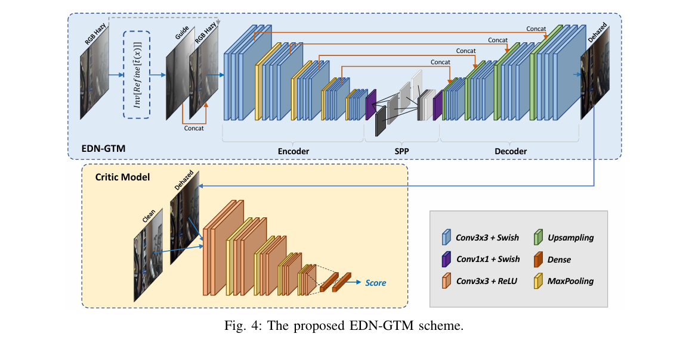
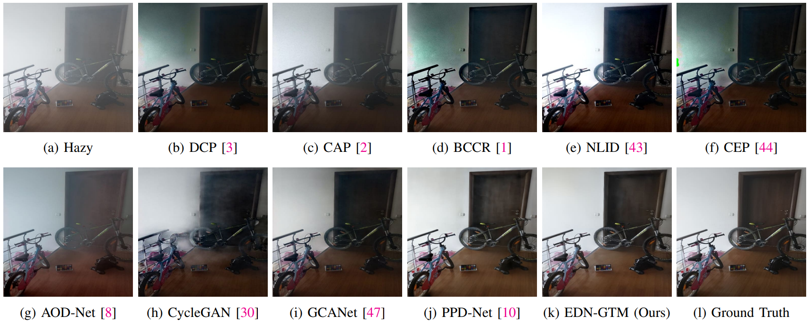
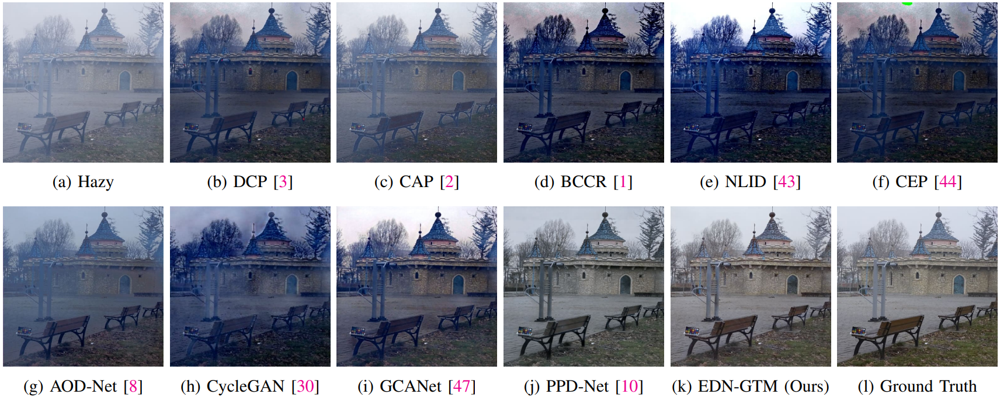
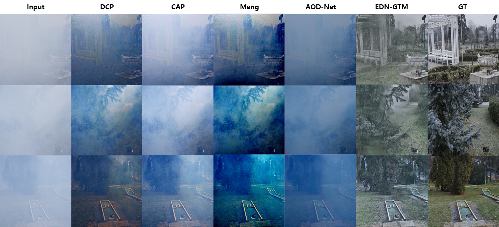
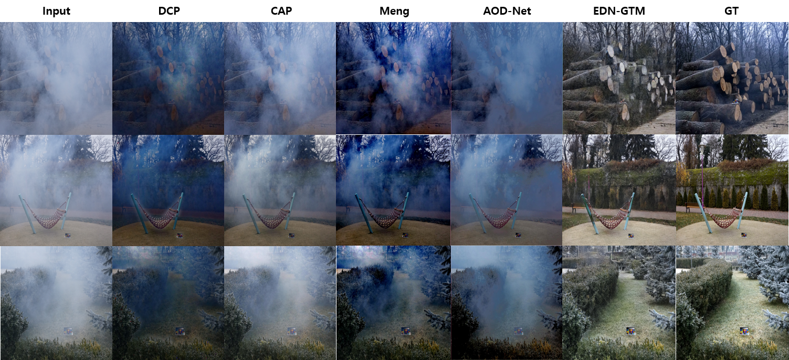
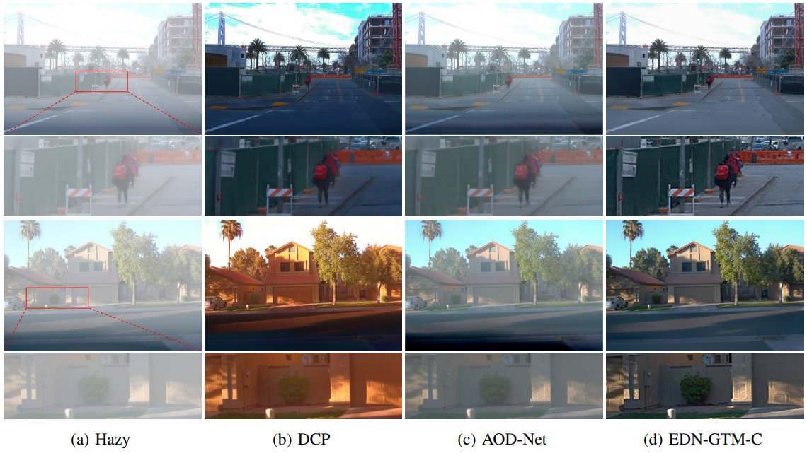
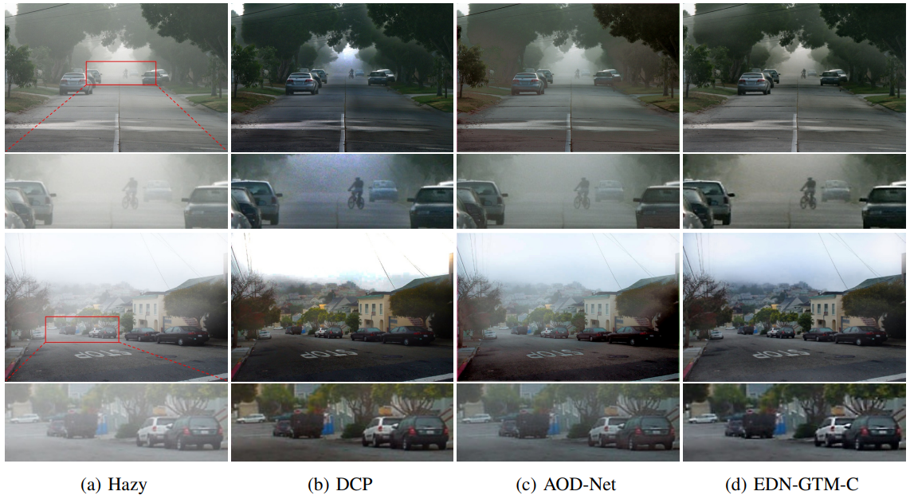
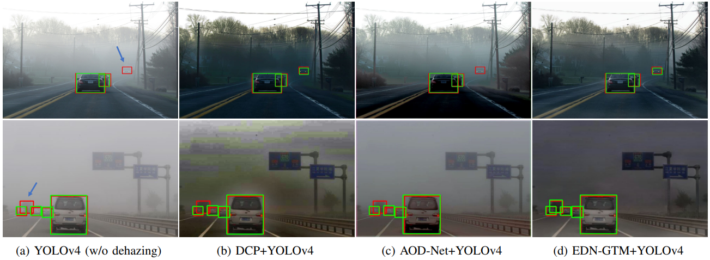

# EDN-GTM: Encoder-Decoder Network with Guided Transmission Map for Effective Image Dehazing

<!--- The official implementation of the paper "A Novel Encoder-Decoder Network with Guided Transmission Map for Single Image Dehazing"   

(Presented in International Conference on Industry Science and Computer Sciences Innovation 2022 ([iSCSi'22](https://iscsi-conference.org/)), Porto, Portugal, March 9-11, 2022)

Authors: [Le-Anh Tran](https://scholar.google.com/citations?user=WzcUE5YAAAAJ&hl=en), Seokyong Moon, Dong-Chul Park --->

<!-- 
## Introduction

An Encoder-Decoder Network with Guided Transmission Map (EDN-GTM) for single image dehazing scheme is proposed in this paper. The proposed EDN-GTM takes conventional RGB hazy image in conjunction with its transmission map estimated by adopting dark channel prior as the inputs of the network. The proposed EDN-GTM utilizes U-Net for image segmentation as the core network and utilizes various modifications including spatial pyramid pooling module and Swish activation to achieve state-of-the-art dehazing performance. Experiments on benchmark datasets show that the proposed EDN-GTM outperforms most of traditional and deep learning-based image dehazing schemes in terms of PSNR and SSIM metrics. The proposed EDN-GTM furthermore proves its applicability to object detection problems. Specifically, when applied to an image preprocessing tool for driving object detection, the proposed EDN-GTM can efficiently remove haze and significantly improve detection accuracy by 4.73% in terms of mAP measure.  -->

<!--- i. Publication: [Procedia Computer Science 204](https://www.sciencedirect.com/science/article/pii/S1877050922008201?via%3Dihub#!)   

 Preprint version: [arXiv](https://arxiv.org/abs/2202.04757) Published version: [Procedia Computer Science 204](https://www.sciencedirect.com/science/article/pii/S1877050922008201?via%3Dihub#!) --->

<!---
ii. Blog: [Towards Data Science](https://tranlevision.medium.com/edn-gtm-encoder-decoder-network-with-guided-transmission-map-for-single-image-dehazing-78e8036bbaa3)

iii. Results on [Papers With Code](https://paperswithcode.com/)

- [](https://paperswithcode.com/sota/image-dehazing-on-i-haze?p=a-novel-encoder-decoder-network-with-guided)    
- [](https://paperswithcode.com/sota/image-dehazing-on-o-haze?p=a-novel-encoder-decoder-network-with-guided)    
- [](https://paperswithcode.com/sota/image-dehazing-on-dense-haze?p=a-novel-encoder-decoder-network-with-guided)    
- [](https://paperswithcode.com/sota/nonhomogeneous-image-dehazing-on-nh-haze?p=a-novel-encoder-decoder-network-with-guided)

iv. Abstract:   

<p align="justify">A novel Encoder-Decoder Network with Guided Transmission Map (EDN-GTM) for single image dehazing scheme is proposed in this paper. The proposed EDN-GTM takes conventional RGB hazy image in conjunction with its transmission map estimated by adopting dark channel prior as the inputs of the network. The proposed EDN-GTM adopts U-Net for image segmentation as the core network and utilizes various modifications including spatial pyramid pooling module and Swish activation to achieve state-of-the-art dehazing performance. Experiments on benchmark datasets show that the proposed EDN-GTM outperforms most of traditional and deep learning-based image dehazing schemes in terms of PSNR and SSIM metrics. The proposed EDN-GTM furthermore proves its applicability to object detection problems. Specifically, when applied to an image preprocessing tool for driving object detection, the proposed EDN-GTM can efficiently remove haze and significantly improve detection accuracy by 4.73% in terms of mAP measure.</p>

v. Architecture: --->

## Updates

The following items are about to be uploaded:

- [x] Pre-trained models for test on SOTS-Outdoor and HSTS datasets
- [ ] Results on SOTS-Outdoor and HSTS datasets

## Introduction

Network Architecture:

<p align="center">

</p>

<!-- Model Checklist: -->


## Requirements

Main dependencies (or equivalent):

- CUDA 10.0
- CUDNN 7.6
- OpenCV
- Tensorflow 1.14.0
- Keras 2.1.3

For other packages, simply run:
```bashrc
$ pip install -r requirements.txt
```

## Test using Pre-trained Weights

#### 1. Download Pre-trained Weights
- Download pre-trained weights from [GoogleDrive](https://drive.google.com/drive/folders/1SjakD7bzNbZm5K8KxBYgXE5DgdEjFiQt)
- Pre-trained weights are available for test on: I-HAZE, O-HAZE, Dense-HAZE, NH-HAZE, SOTS-Outdoor datasets (respective to their filenames)
- Create a folder 'weights' to place downloaded weight files

#### 2. Correct Data Paths in [test_on_images.py](https://github.com/tranleanh/edn-gtm/blob/main/test_on_images.py)
- Path to pre-trained weight: [weight_path](https://github.com/tranleanh/edn-gtm/blob/6c3d5ebb058cfde72aea57c0d90c6e8b40216ca1/test_on_images.py#L58) 
- Path to output directory: [output_dir](https://github.com/tranleanh/edn-gtm/blob/6c3d5ebb058cfde72aea57c0d90c6e8b40216ca1/test_on_images.py#L63)
- Path to folder containing test images: [img_src](https://github.com/tranleanh/edn-gtm/blob/6c3d5ebb058cfde72aea57c0d90c6e8b40216ca1/test_on_images.py#L69)

#### 3. Run Test Script

```bashrc
$ python test_on_images.py
```

## Train

#### 1. Prepare Dataset
- Each image in a clean-hazy image pair must have the same name
- Make Folder 'A' and Folder 'B' containing hazy and clean images, respectively

#### 2. Correct Data Paths in [train.py](https://github.com/tranleanh/edn-gtm/blob/main/train.py)
- Path to folder containing train data: [path/to/data](https://github.com/tranleanh/edn-gtm/blob/6c3d5ebb058cfde72aea57c0d90c6e8b40216ca1/train.py#L39)
- Note that [path/to/data](https://github.com/tranleanh/edn-gtm/blob/6c3d5ebb058cfde72aea57c0d90c6e8b40216ca1/train.py#L39) nevigates to the parent directory of 'A' and 'B' like below:

```bashrc
-- path/to/data /
                |- A (containing hazy images)
                |- B (containing clean images)
```

#### 3. Run Train Script
```bashrc
$ python train.py
```


## Results

#### 1. Quantitative Results (#Params: Number of parameters, MACs: multiply-accumulate operations measured on 512x512 input)

#### (a) I-HAZE & O-HAZE Datasets:

<!---
<table>
  <tr>
    <th rowspan="2">Types</th>
    <th rowspan="2">Approaches</th>
    <th colspan="2">I-HAZE Dataset</th>
    <th colspan="2">O-HAZE Dataset</th>
    <th rowspan="2">#Params</th>
  </tr>
  <tr>
    <th>PSNR</th>
    <th>SSIM</th>
    <th>PSNR</th>
    <th>SSIM</th>
  </tr>
  <tr>
    <th rowspan="4">Prior</th>
    <td>CAP</td>
    <td>12.24</td>
    <td>0.6065</td>
    <td>16.08</td>
    <td>0.5965</td>
    <td>-</td>
  </tr>
  <tr> 
    <td>DCP</td>
    <td>14.43</td>
    <td>0.7516</td>
    <td>16.78</td>
    <td>0.6532</td>
    <td>-</td>
  </tr>
  <tr>
    <td>BCCR</td>
    <td>14.15</td>
    <td>0.7046</td>
    <td>14.07</td>
    <td>0.5103</td>
    <td>-</td>
  </tr>
  <tr>
    <td>NLID</td>
    <td>14.12</td>
    <td>0.6537</td>
    <td>15.98</td>
    <td>0.5849</td>
    <td>-</td>
  </tr>
  <tr>
    <th rowspan="7">CNN</th>
    <td>AOD-Net</td>
    <td>13.98</td>
    <td>0.7323</td>
    <td>15.03</td>
    <td>0.5385</td>
    <td>0.002M</td>
  </tr>
  <tr>
    <td>MSCNN</td>
    <td>15.22</td>
    <td>0.7545</td>
    <td>17.56</td>
    <td>0.6495</td>
    <td>0.008M</td>
  </tr>
  <tr>
    <td>DehazeNet</td>
    <td>15.93</td>
    <td>0.7734</td>
    <td>19.99</td>
    <td>0.6885</td>
    <td>0.009M</td>
  </tr>
  <tr>
    <td>FFA-Net</td>
    <td>17.20</td>
    <td>0.7943</td>
    <td>22.74</td>
    <td>0.8339 &#129351;</td>
    <td>4.46M</td>
  </tr>
  <tr>
    <td>CycleGAN</td>
    <td>17.80</td>
    <td>0.7500</td>
    <td>18.92</td>
    <td>0.5300</td>
    <td>11.38M</td>
  </tr>
  <tr>
    <td>Cycle-Dehaze</td>
    <td>18.03</td>
    <td>0.8000</td>
    <td>19.92</td>
    <td>0.6400</td>
    <td>11.38M</td>
  </tr>
  <tr>
    <td>PPD-Net</td>
    <td>22.53</td>
    <td>0.8705 &#129351;</td>
    <td>24.24 &#129351;</td>
    <td>0.7205</td>
    <td>31.28M</td>
  </tr>
  <tr>
    <th rowspan="3">CNN (ours)</th>
    <td><b>EDN-GTM-S</b></td>
    <td>21.23</td>
    <td>0.8181</td>
    <td>22.91</td>
    <td>0.8016</td>
    <td>8.4M</td>
  </tr>
  <tr>
    <td><b>EDN-GTM-B</b></td>
    <td>22.66 &#129352;</td>
    <td>0.8311 &#129352;</td>
    <td>23.43</td>
    <td>0.8283 &#129352;</td>
    <td>33M</td>
  </tr>
  <tr>
    <td><b>EDN-GTM-L</b></td>
    <td>22.90 &#129351;</td>
    <td>0.8270</td>
    <td>23.46 &#129352;</td>
    <td>0.8198</td>
    <td>49M</td>
  </tr>
</table>
--->


<table>
  <tr>
    <th rowspan="2">Types</th>
    <th rowspan="2">Methods</th>
    <th colspan="2">I-HAZE</th>
    <th colspan="2">O-HAZE</th>
    <th rowspan="2">#Params</th>
    <th rowspan="2">MACs</th>
  </tr>
  <tr>
    <th>PSNR</th>
    <th>SSIM</th>
    <th>PSNR</th>
    <th>SSIM</th>
  </tr>
  <tr>
    <th rowspan="4">Prior</th>
    <td>CAP</td>
    <td>12.24</td>
    <td>0.6065</td>
    <td>16.08</td>
    <td>0.5965</td>
    <td>-</td>
    <td>-</td>
  </tr>
  <tr> 
    <td>DCP</td>
    <td>14.43</td>
    <td>0.7516</td>
    <td>16.78</td>
    <td>0.6532</td>
    <td>-</td>
    <td>-</td>
  </tr>
  <tr>
    <td>BCCR</td>
    <td>14.15</td>
    <td>0.7046</td>
    <td>14.07</td>
    <td>0.5103</td>
    <td>-</td>
    <td>-</td>
  </tr>
  <tr>
    <td>NLID</td>
    <td>14.12</td>
    <td>0.6537</td>
    <td>15.98</td>
    <td>0.5849</td>
    <td>-</td>
    <td>-</td>
  </tr>
  <tr>
    <th rowspan="7">CNN</th>
    <td>AOD-Net</td>
    <td>13.98</td>
    <td>0.7323</td>
    <td>15.03</td>
    <td>0.5385</td>
    <td>0.002M</td>
    <td>0.46G</td>
  </tr>
  <tr>
    <td>MSCNN</td>
    <td>15.22</td>
    <td>0.7545</td>
    <td>17.56</td>
    <td>0.6495</td>
    <td>0.008M</td>
    <td>2.10G</td>
  </tr>
  <tr>
    <td>DehazeNet</td>
    <td>15.93</td>
    <td>0.7734</td>
    <td>19.99</td>
    <td>0.6885</td>
    <td>0.009M</td>
    <td>2.32G</td>
  </tr>
  <tr>
    <td>FFA-Net</td>
    <td>17.20</td>
    <td>0.7943</td>
    <td>22.74</td>
    <td>0.8339</td>
    <td>4.46M</td>
    <td>1151G</td>
  </tr>
  <tr>
    <td>CycleGAN</td>
    <td>17.80</td>
    <td>0.7500</td>
    <td>18.92</td>
    <td>0.5300</td>
    <td>11.38M</td>
    <td>232G</td>
  </tr>
  <tr>
    <td>Cycle-Dehaze</td>
    <td>18.03</td>
    <td>0.8000</td>
    <td>19.92</td>
    <td>0.6400</td>
    <td>11.38M</td>
    <td>232G</td>
  </tr>
  <tr>
    <td>PPD-Net</td>
    <td>22.53</td>
    <td>0.8705</td>
    <td>24.24</td>
    <td>0.7205</td>
    <td>31.28M</td>
    <td>204G</td>
  </tr>
  <tr>
    <th rowspan="3">CNN (ours)</th>
    <td><b>EDN-GTM-S</b></td>
    <td>21.23</td>
    <td>0.8181</td>
    <td>22.91</td>
    <td>0.8016</td>
    <td>8.4M</td>
    <td>56G</td>
  </tr>
  <tr>
    <td><b>EDN-GTM-B</b></td>
    <td>22.66</td>
    <td>0.8311</td>
    <td>23.43</td>
    <td>0.8283</td>
    <td>33M</td>
    <td>220G</td>
  </tr>
  <tr>
    <td><b>EDN-GTM-L</b></td>
    <td>22.90</td>
    <td>0.8270</td>
    <td>23.46</td>
    <td>0.8198</td>
    <td>49M</td>
    <td>308G</td>
  </tr>
</table>


#### (b) Dense-HAZE & NH-HAZE Datasets

<!---
<table>
  <tr>
    <th rowspan="2">Types</th>
    <th rowspan="2">Approaches</th>
    <th colspan="2">Dense-HAZE Dataset</th>
    <th colspan="2">NH-HAZE Dataset</th>
    <th rowspan="2">#Params</th>
  </tr>
  <tr>
    <th>PSNR</th>
    <th>SSIM</th>
    <th>PSNR</th>
    <th>SSIM</th>
  </tr>
  <tr>
    <th rowspan="4">Prior</th>
    <td>NLID</td>
    <td>9.15</td>
    <td>0.4141</td>
    <td>8.94</td>
    <td>0.3584</td>
    <td>-</td>
  </tr>
  <tr>
    <td>DCP</td>
    <td>10.06</td>
    <td>0.3856</td>
    <td>10.57</td>
    <td>0.5196</td>
    <td>-</td>
  </tr>
  <tr>
    <td>CAP</td>
    <td>11.01</td>
    <td>0.4874</td>
    <td>12.58</td>
    <td>0.4231</td>
    <td>-</td>
  </tr>
  <tr>
    <td>BCCR</td>
    <td>11.24</td>
    <td>0.3514</td>
    <td>12.48</td>
    <td>0.4233</td>
    <td>-</td>
  </tr>
  <tr>
    <th rowspan="7">CNN</th>
    <td>DehazeNet</td>
    <td>13.84</td>
    <td>0.4252</td>
    <td>16.62</td>
    <td>0.5238</td>
    <td>0.009M</td>
  </tr>
  <tr>
    <td>AOD-Net</td>
    <td>13.14</td>
    <td>0.4144</td>
    <td>15.40</td>
    <td>0.5693</td>
    <td>0.002M</td>
  </tr>
  <tr>
    <td>GridDehazeNet</td>
    <td>13.31</td>
    <td>0.3681</td>
    <td>13.80</td>
    <td>0.5370</td>
    <td>0.956M</td>
  </tr>
  <tr>
    <td>KDDN</td>
    <td>14.28</td>
    <td>0.4074</td>
    <td>17.39</td>
    <td>0.5897</td>
    <td>5.99M</td>
  </tr>
  <tr>
    <td>FFA-Net</td>
    <td>14.39</td>
    <td>0.4524</td>
    <td>19.87</td>
    <td>0.6915</td>
    <td>4.46M</td>
  </tr>
  <tr>
    <td>MSBDN</td>
    <td>15.37</td>
    <td>0.4858</td>
    <td>19.23</td>
    <td>0.7056</td>
    <td>31.35M</td>
  </tr>
  <tr>
    <td>AECR-Net</td>
    <td>15.80 &#129351;</td>
    <td>0.4660</td>
    <td>19.88 &#129352;</td>
    <td>0.7173 &#129352;</td>
    <td>2.61M</td>
  </tr>
  <tr>
    <th rowspan="3">CNN (ours)</th>
    <td><b>EDN-GTM-S</b></td>
    <td>15.20</td>
    <td>0.5160</td>
    <td>19.04</td>
    <td>0.6961</td>
    <td>8.4M</td>
  </tr>
  <tr>
    <td><b>EDN-GTM-B</b></td>
    <td>15.46 &#129352;</td>
    <td>0.5359 &#129351;</td>
    <td>19.80</td>
    <td>0.7064</td>
    <td>33M</td>
  </tr>
  <tr>
    <td><b>EDN-GTM-L</b></td>
    <td>15.43</td>
    <td>0.5200 &#129352;</td>
    <td>20.24 &#129351;</td>
    <td>0.7178 &#129351;</td>
    <td>49M</td>
  </tr>
</table>
--->

<table>
  <tr>
    <th rowspan="2">Types</th>
    <th rowspan="2">Methods</th>
    <th colspan="2">Dense-HAZE</th>
    <th colspan="2">NH-HAZE</th>
    <th rowspan="2">#Params</th>
    <th rowspan="2">MACs</th>
  </tr>
  <tr>
    <th>PSNR</th>
    <th>SSIM</th>
    <th>PSNR</th>
    <th>SSIM</th>
  </tr>
  <tr>
    <th rowspan="4">Prior</th>
    <td>NLID</td>
    <td>9.15</td>
    <td>0.4141</td>
    <td>8.94</td>
    <td>0.3584</td>
    <td>-</td>
    <td>-</td>
  </tr>
  <tr>
    <td>DCP</td>
    <td>10.06</td>
    <td>0.3856</td>
    <td>10.57</td>
    <td>0.5196</td>
    <td>-</td>
    <td>-</td>
  </tr>
  <tr>
    <td>CAP</td>
    <td>11.01</td>
    <td>0.4874</td>
    <td>12.58</td>
    <td>0.4231</td>
    <td>-</td>
    <td>-</td>
  </tr>
  <tr>
    <td>BCCR</td>
    <td>11.24</td>
    <td>0.3514</td>
    <td>12.48</td>
    <td>0.4233</td>
    <td>-</td>
    <td>-</td>
  </tr>
  <tr>
    <th rowspan="7">CNN</th>
    <td>DehazeNet</td>
    <td>13.84</td>
    <td>0.4252</td>
    <td>16.62</td>
    <td>0.5238</td>
    <td>0.009M</td>
  </tr>
  <tr>
    <td>AOD-Net</td>
    <td>13.14</td>
    <td>0.4144</td>
    <td>15.40</td>
    <td>0.5693</td>
    <td>0.002M</td>
    <td>0.46G</td>
  </tr>
  <tr>
    <td>GridDehaze</td>
    <td>13.31</td>
    <td>0.3681</td>
    <td>13.80</td>
    <td>0.5370</td>
    <td>0.956M</td>
    <td>85.9G</td>
  </tr>
  <tr>
    <td>KDDN</td>
    <td>14.28</td>
    <td>0.4074</td>
    <td>17.39</td>
    <td>0.5897</td>
    <td>5.99M</td>
    <td>40.6G</td>
  </tr>
  <tr>
    <td>FFA-Net</td>
    <td>14.39</td>
    <td>0.4524</td>
    <td>19.87</td>
    <td>0.6915</td>
    <td>4.46M</td>
    <td>1151G</td>
  </tr>
  <tr>
    <td>MSBDN</td>
    <td>15.37</td>
    <td>0.4858</td>
    <td>19.23</td>
    <td>0.7056</td>
    <td>31.35M</td>
    <td>166G</td>
  </tr>
  <tr>
    <td>AECR-Net</td>
    <td>15.80</td>
    <td>0.4660</td>
    <td>19.88</td>
    <td>0.7173</td>
    <td>2.61M</td>
    <td>209G</td>
  </tr>
  <tr>
    <th rowspan="3">CNN (ours)</th>
    <td><b>EDN-GTM-S</b></td>
    <td>15.20</td>
    <td>0.5160</td>
    <td>19.04</td>
    <td>0.6961</td>
    <td>8.4M</td>
    <td>56G</td>
  </tr>
  <tr>
    <td><b>EDN-GTM-B</b></td>
    <td>15.46</td>
    <td>0.5359</td>
    <td>19.80</td>
    <td>0.7064</td>
    <td>33M</td>
    <td>220G</td>
  </tr>
  <tr>
    <td><b>EDN-GTM-L</b></td>
    <td>15.43</td>
    <td>0.5200</td>
    <td>20.24</td>
    <td>0.7178</td>
    <td>49M</td>
    <td>308G</td>
  </tr>
</table>


#### 2. Qualitative Results

#### (a) I-HAZE Dataset



#### (b) O-HAZE Dataset



#### (c) Dense-HAZE Dataset



#### (d) NH-HAZE Dataset




#### 3. Application to Object Detection

#### (a) Dehazing in Driving Scenes
Visual dehazing results on synthetic hazy scenes:

<!--  -->


Visual dehazing results on realistic hazy scenes:

<!--  -->


#### (b) Object Detection Performances

(Red: ground-truth, Green: detection)

<!--  -->

Visual dehazing + detection results on synthetic hazy scenes:


Visual dehazing + detection results on realistic hazy scenes:



<!-- ## Citation

```
@article{Tran_2022,	
year = 2022,	
publisher = {Elsevier {BV}},	
volume = {204},	
pages = {682--689},	
author = {Le-Anh Tran and Seokyong Moon and Dong-Chul Park},	
title = {A novel encoder-decoder network with guided transmission map for single image dehazing},	
journal = {Procedia Computer Science}}
``` -->


Have fun!

LA Tran
