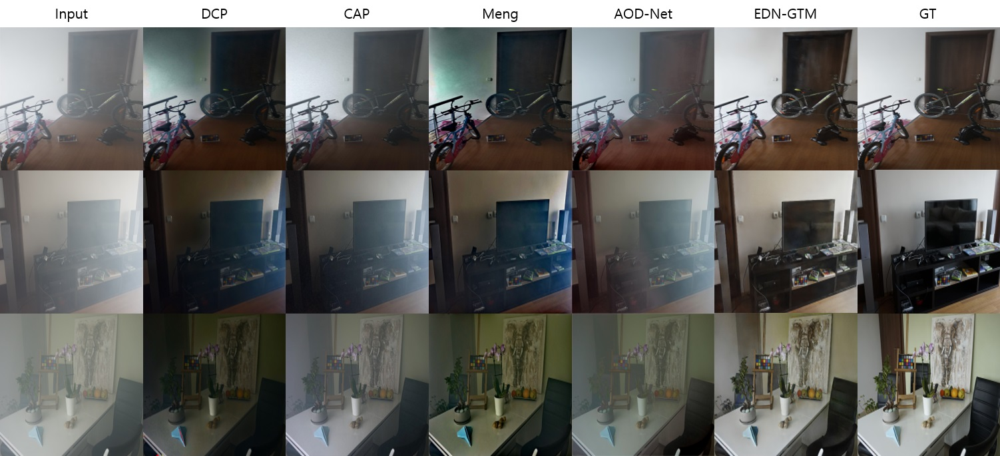
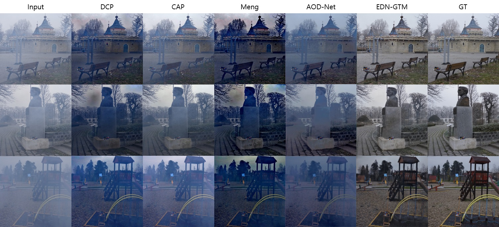
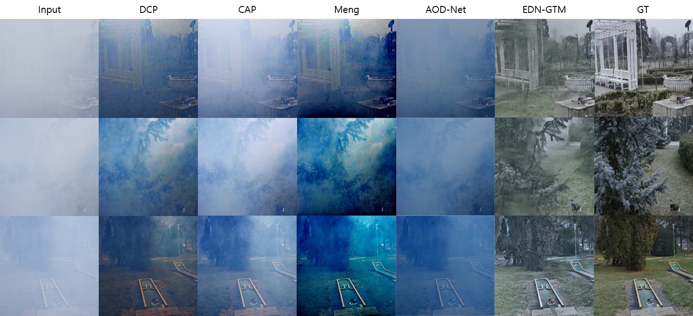
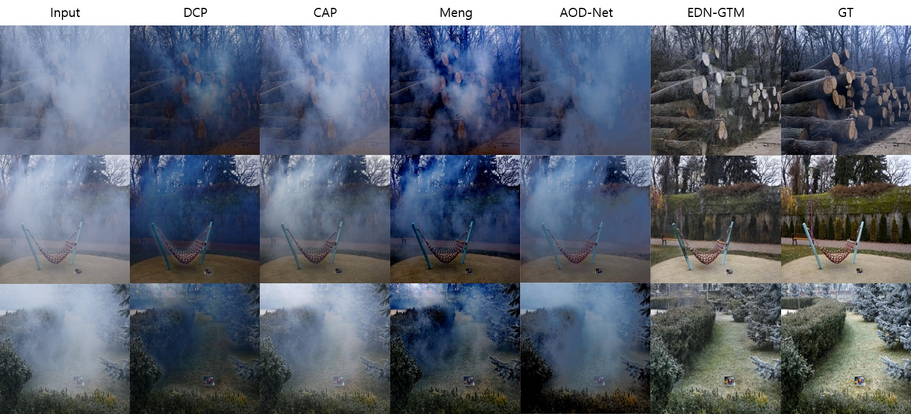
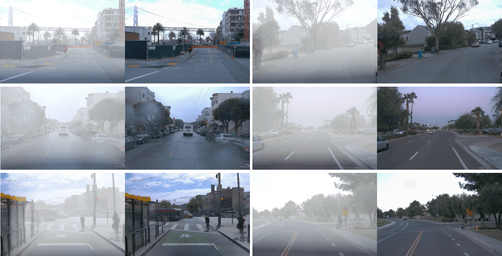
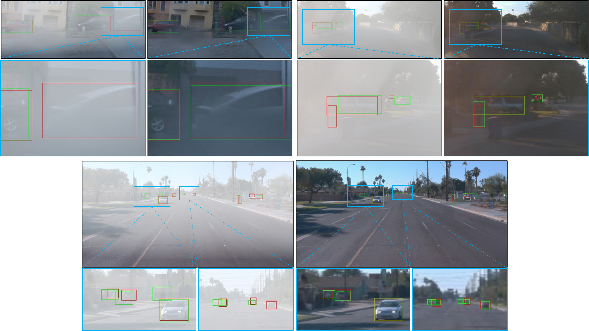

# EDN-GTM: A novel Encoder-Decoder Network with Guided Transmission Map for single image dehazing

This is the official implementation of the paper "A Novel Encoder-Decoder Network with Guided Transmission Map for Single Image Dehazing"   

(in Proceedings of International Conference on Industry Science and Computer Sciences Innovation 2022 ([iSCSi'22](https://iscsi-conference.org/)), Porto, Portugal, March 9-11, 2022)

Authors: [Le-Anh Tran](https://scholar.google.com/citations?user=WzcUE5YAAAAJ&hl=en), Seokyong Moon, Dong-Chul Park


## I. Introduction

i. Links to paer:    
- Preprint version: [arXiv](https://arxiv.org/abs/2202.04757)
- Published version: [Procedia Computer Science](https://www.sciencedirect.com/science/article/pii/S1877050922008201?via%3Dihub#!)

ii. Blog post: [Towards Data Science](https://tranlevision.medium.com/edn-gtm-encoder-decoder-network-with-guided-transmission-map-for-single-image-dehazing-78e8036bbaa3)

iii. Results on [Papers With Code](https://paperswithcode.com/)

- [](https://paperswithcode.com/sota/image-dehazing-on-i-haze?p=a-novel-encoder-decoder-network-with-guided)    
- [](https://paperswithcode.com/sota/image-dehazing-on-o-haze?p=a-novel-encoder-decoder-network-with-guided)    
- [](https://paperswithcode.com/sota/image-dehazing-on-dense-haze?p=a-novel-encoder-decoder-network-with-guided)    
- [](https://paperswithcode.com/sota/nonhomogeneous-image-dehazing-on-nh-haze?p=a-novel-encoder-decoder-network-with-guided)

iv. Abstract:   

<p align="justify">A novel Encoder-Decoder Network with Guided Transmission Map (EDN-GTM) for single image dehazing scheme is proposed in this paper. The proposed EDN-GTM takes conventional RGB hazy image in conjunction with its transmission map estimated by adopting dark channel prior as the inputs of the network. The proposed EDN-GTM adopts U-Net for image segmentation as the core network and utilizes various modifications including spatial pyramid pooling module and Swish activation to achieve state-of-the-art dehazing performance. Experiments on benchmark datasets show that the proposed EDN-GTM outperforms most of traditional and deep learning-based image dehazing schemes in terms of PSNR and SSIM metrics. The proposed EDN-GTM furthermore proves its applicability to object detection problems. Specifically, when applied to an image preprocessing tool for driving object detection, the proposed EDN-GTM can efficiently remove haze and significantly improve detection accuracy by 4.73% in terms of mAP measure.</p>

v. Architecture: 

<p align="center">

</p>


## II. Requirements

Main dependencies (or equivalent):

- CUDA 10.0
- CUDNN 7.6
- OpenCV
- Tensorflow 1.14.0
- Keras 2.1.3

For other packages, simply run:
```bashrc
$ pip install -r requirements.txt
```

## III. Test using Pre-trained Weights

#### 1. Download Pre-trained Weights
- Download pre-trained weights from [GoogleDrive](https://drive.google.com/drive/folders/1SjakD7bzNbZm5K8KxBYgXE5DgdEjFiQt)
- There are 4 weight files available for test on I-HAZE, O-HAZE, Dense-HAZE, NH-HAZE datasets (respective to their filenames)
- Make a folder 'weights' to locate downloaded weight files

#### 2. Correct Data Paths in [test_on_images.py](https://github.com/tranleanh/edn-gtm/blob/main/test_on_images.py)
- Path to pre-trained weight: [weight_path](https://github.com/tranleanh/edn-gtm/blob/6c3d5ebb058cfde72aea57c0d90c6e8b40216ca1/test_on_images.py#L58) 
- Path to output directory: [output_dir](https://github.com/tranleanh/edn-gtm/blob/6c3d5ebb058cfde72aea57c0d90c6e8b40216ca1/test_on_images.py#L63)
- Path to folder containing test images: [img_src](https://github.com/tranleanh/edn-gtm/blob/6c3d5ebb058cfde72aea57c0d90c6e8b40216ca1/test_on_images.py#L69)

#### 3. Run Test Script

```bashrc
$ python test_on_images.py
```

## IV. Train Network

#### 1. Prepare Dataset
- Each image in a clean-hazy image pair must have the same name
- Make Folder 'A' and Folder 'B' containing hazy and clean images, respectively

#### 2. Correct Data Paths in [train.py](https://github.com/tranleanh/edn-gtm/blob/main/train.py)
- Path to folder containing train data: [path/to/data](https://github.com/tranleanh/edn-gtm/blob/6c3d5ebb058cfde72aea57c0d90c6e8b40216ca1/train.py#L39)
- Note that [path/to/data](https://github.com/tranleanh/edn-gtm/blob/6c3d5ebb058cfde72aea57c0d90c6e8b40216ca1/train.py#L39) nevigates to the parent directory of 'A' and 'B' like below:

```bashrc
-- path/to/data /
                |- A (containing hazy images)
                |- B (containing clean images)
```

#### 3. Run Train Script
```bashrc
$ python train.py
```


## V. Results

#### 1. Quantitative Results
#### (a) I-HAZE Dataset

|     |  DCP (TPAMI’10)  | CAP (TIP’15) | MSCNN (ECCV’16) | NLID (CVPR’1) | AOD-Net (ICCV’17) | PPD-Net (CVPRW’18) | EDN-GTM           | 
| :---:     |   :---:          |   :---:      |    :----:       |    :---:      |          :---:    |    :----:          |    :---:           |
|  PSNR     |   14.43          |    12.24     |    15.22        |    14.12      |         13.98     |   22.53 (2nd)      |   22.90 (1st)      |
|  SSIM     |   0.7516         |    0.6065    |    0.7545       |    0.6537     |         0.7323    |   0.8705 (1st)      |  0.8270 (2nd)      |

#### (b) O-HAZE Dataset

|     |  DCP (TPAMI’10)  | CAP (TIP’15) | MSCNN (ECCV’16) | NLID (CVPR’1) | AOD-Net (ICCV’17) | PPD-Net (CVPRW’18) |  EDN-GTM      | 
| :---:     |   :---:          |   :---:      |    :----:       |    :---:      |          :---:    |    :----:          |     :---:           |
|  PSNR     |   16.78          |    16.08     |    17.56        |    15.98      |         15.03     |    24.24 (1st)    |     23.46 (2nd)     |
|  SSIM     |   0.6532         |    0.5965    |    0.6495       |    0.5849     |         0.5385    |   0.7205 (2nd)     |      0.8198 (1st)   |

#### (c) Dense-HAZE Dataset

|     |  DCP (TPAMI’10)  | DehazeNet (TIP’16) | AOD-Net (ICCV’17) | MSBDN (CVPR’20) | KDDN (CVPR’20)    | AECR-Net (CVPR’21)  | EDN-GTM       | 
| :---:     |   :---:          |   :---:            |    :----:         |    :---:        |          :---:    |    :----:           |    :---:           |
|  PSNR     |   10.06          |    13.84           |    13.14          |    15.37        |         14.28     |    15.80 (1st)      |  15.43 (2nd)       |
|  SSIM     |   0.3856         |    0.4252          |    0.4144         |    0.4858       |         0.4074    |  0.4660 (2nd)       |     0.5200 (1st)   |

#### (d) NH-HAZE Dataset

|     |  DCP (TPAMI’10)  | DehazeNet (TIP’16) | AOD-Net (ICCV’17) | MSBDN (CVPR’20) | KDDN (CVPR’20)    | AECR-Net (CVPR’21)  | EDN-GTM   | 
| :---:     |   :---:          |   :---:            |    :----:         |    :---:        |          :---:    |    :----:           |    :---:        |
|  PSNR     |   10.57          |    16.62           |    15.40          |    19.23        |      17.39        |  19.88 (2nd)        |   20.24 (1st)   |
|  SSIM     |   0.5196         |    0.5238          |    0.5693         |    0.7056       |      0.5897       |  0.7173 (2nd)       |   0.7178 (1st)  |

#### 2. Qualitative Results

#### (a) I-HAZE Dataset



#### (b) O-HAZE Dataset



#### (c) Dense-HAZE Dataset



#### (d) NH-HAZE Dataset




#### 3. Application to Object Detection

#### (a) Dehazing in Driving Scenes
Visual results on synthesized hazy driving scenes (left: synthesized hazy image, right: dehazed image).



#### (b) Object Detection Performances
Object detection performances on two sets of hazy (left) and dehazed (right) images (red: ground-truth box, green: predicted box, blue: zoom-in region).



## VI. Citation

```
@article{Tran_2022,	
year = 2022,	
publisher = {Elsevier {BV}},	
volume = {204},	
pages = {682--689},	
author = {Le-Anh Tran and Seokyong Moon and Dong-Chul Park},	
title = {A novel encoder-decoder network with guided transmission map for single image dehazing},	
journal = {Procedia Computer Science}}
```


Have fun!

LA Tran

Dec. 2021
