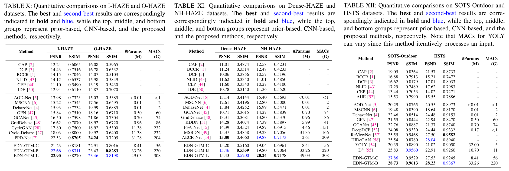
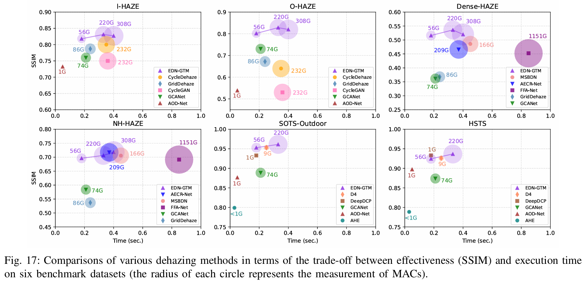
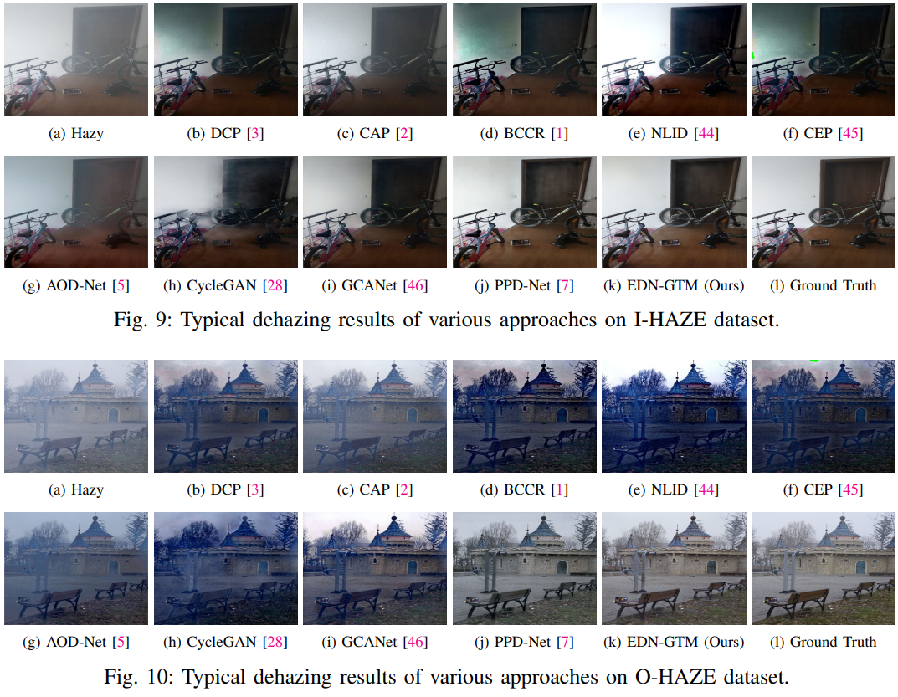
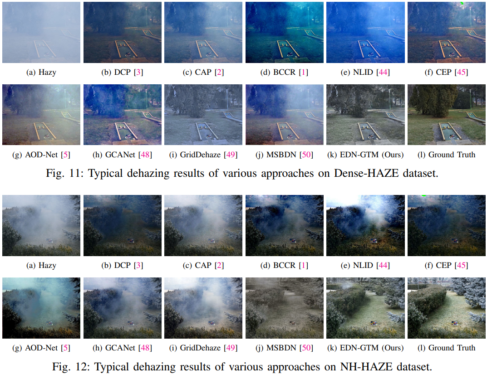
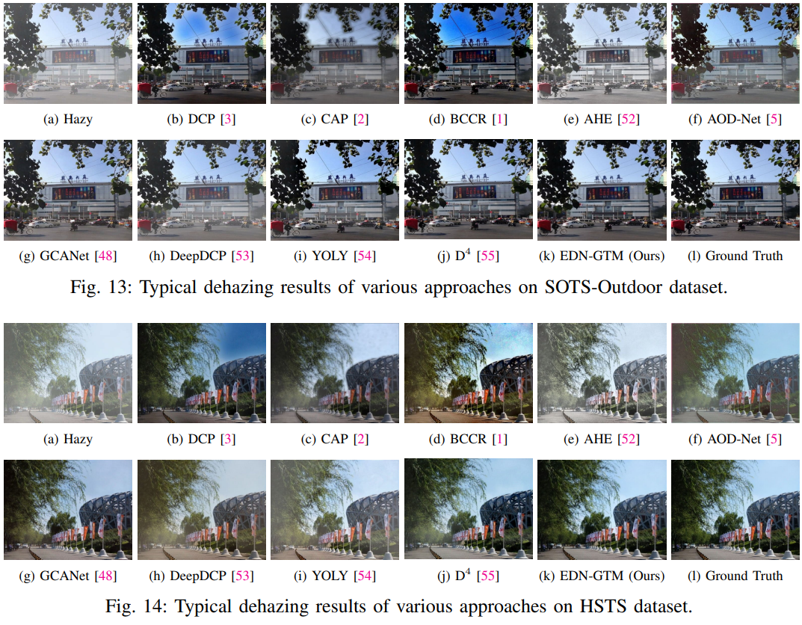

# EDN-GTM: Encoder-Decoder Network with Guided Transmission Map

[](https://huggingface.co/tranleanh/edn-gtm)
[](https://towardsdatascience.com/edn-gtm-encoder-decoder-network-with-guided-transmission-map-for-single-image-dehazing-78e8036bbaa3)
[](https://www.sciencedirect.com/science/article/pii/S1877050922008201)
[](https://link.springer.com/article/10.1007/s00371-024-03330-5)

The official implementation of the paper [Encoder-Decoder Networks with Guided Transmission Map for Effective Image Dehazing](https://link.springer.com/article/10.1007/s00371-024-03330-5).

Authors: [Le-Anh Tran](https://scholar.google.com/citations?user=WzcUE5YAAAAJ&hl=en), [Dong-Chul Park](https://scholar.google.com/citations?user=VZUH4sUAAAAJ&hl=en)

Journal: [The Visual Computer](https://link.springer.com/article/10.1007/s00371-024-03330-5) (Springer), 2024

## Introduction

Network Architecture:

<p align="center">

</p>

<!-- Model Checklist: -->


## Requirements

Main dependencies (or equivalent):

- CUDA 10.0
- CUDNN 7.6
- OpenCV
- Tensorflow 1.14.0
- Keras 2.1.3

For other packages, simply run:
```bashrc
$ pip install -r requirements.txt
```

## Test using Pre-trained Weights

#### Step 1: Download Pre-trained Weights
- Download pre-trained weights from [GoogleDrive](https://drive.google.com/drive/folders/1SjakD7bzNbZm5K8KxBYgXE5DgdEjFiQt) or [HuggingFace](https://huggingface.co/tranleanh/edn-gtm)
- Pre-trained weights are available for test on: I-HAZE, O-HAZE, Dense-HAZE, NH-HAZE, SOTS-Outdoor datasets (respective to their filenames)
- Create a folder 'weights' to place downloaded weight files

#### Step 2: Correct Data Paths in [test_on_images.py](https://github.com/tranleanh/edn-gtm/blob/main/test_on_images.py)
- Path to pre-trained weight: [weight_path](https://github.com/tranleanh/edn-gtm/blob/6c3d5ebb058cfde72aea57c0d90c6e8b40216ca1/test_on_images.py#L58) 
- Path to output directory: [output_dir](https://github.com/tranleanh/edn-gtm/blob/6c3d5ebb058cfde72aea57c0d90c6e8b40216ca1/test_on_images.py#L63)
- Path to folder containing test images: [img_src](https://github.com/tranleanh/edn-gtm/blob/6c3d5ebb058cfde72aea57c0d90c6e8b40216ca1/test_on_images.py#L69)

#### Step 3: Run Test Script

```bashrc
$ python test_on_images.py
```

## Train

#### Step 1: Prepare Dataset
- Each image in a clean-hazy image pair must have the same name
- Make Folder 'A' and Folder 'B' containing hazy and clean images, respectively

#### Step 2: Correct Data Paths in [train.py](https://github.com/tranleanh/edn-gtm/blob/main/train.py)
- Path to folder containing train data: [path/to/data](https://github.com/tranleanh/edn-gtm/blob/6c3d5ebb058cfde72aea57c0d90c6e8b40216ca1/train.py#L39)
- Note that [path/to/data](https://github.com/tranleanh/edn-gtm/blob/6c3d5ebb058cfde72aea57c0d90c6e8b40216ca1/train.py#L39) nevigates to the parent directory of 'A' and 'B' like below:

```bashrc
-- path/to/data /
                |- A (containing hazy images)
                |- B (containing clean images)
```
#### Step 3: Run Train Script
```bashrc
$ python train.py
```


## Results

### Quantitative results

<p align="center">

</p>

### SSIM-Speed charts

<p align="center">

</p>


### Visual results

#### Results on I-HAZE & O-HAZE Datasets



#### Results on Dense-HAZE & NH-HAZE Datasets



#### Results on SOTS-Outdoor & HSTS Datasets




### Application to Object Detection

#### Dehazing in Driving Scenes
Visual dehazing results on synthetic hazy scenes:

<!--  -->


Visual dehazing results on realistic hazy scenes:

<!--  -->


#### Object Detection

(Red: ground-truth, Green: detection)

<!--  -->

Visual dehazing + detection results on synthetic hazy scenes:


Visual dehazing + detection results on realistic hazy scenes:


## Citation

```bibtex
@article{tran2022novel,
  title={A novel encoder-decoder network with guided transmission map for single image dehazing},
  author={Tran, Le-Anh and Moon, Seokyong and Park, Dong-Chul},
  journal={Procedia Computer Science},
  volume={204},
  pages={682--689},
  year={2022},
  publisher={Elsevier}
}

@article{tran2024encoder,
  title={Encoder-decoder networks with guided transmission map for effective image dehazing},
  author={Tran, Le-Anh and Park, Dong-Chul},
  journal={The Visual Computer},
  pages={1--24},
  year={2024},
  publisher={Springer}
}
```


Have fun!

LA Tran
