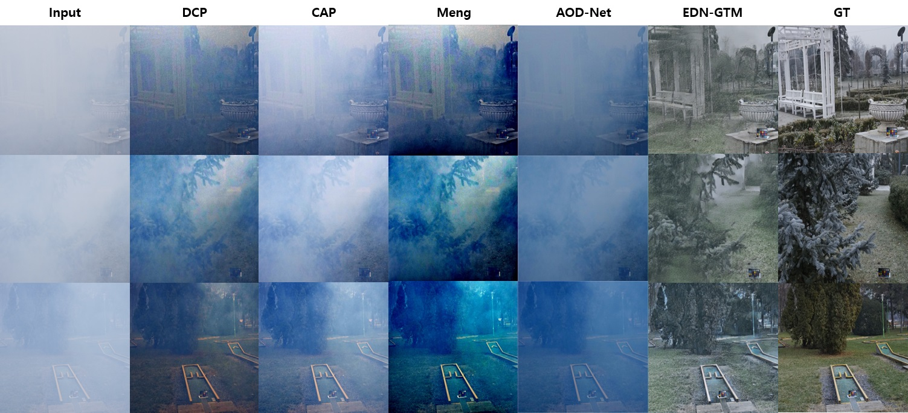

# EDN-GTM: A Novel Encoder-Decoder Network with Guided Transmission Map for Single Image Dehazing

Official Implementation of "EDN-GTM: A Novel Encoder-Decoder Network with Guided Transmission Map for Single Image Dehazing"

Paper: (to be updated)

Medium article: (will be updated)

### Dependencies
- OpenCV
- Tensorflow 1.14.0
- Keras 2.1.3
<!-- - [more](https://pjreddie.com/darknet/yolo/) -->

You can simply run:
```bashrc
$ pip install -r requirements.txt
```

### How to Use

#### 1. Download pre-trained weights
- Download weight files from this link

- Locate weight files in folder: weights/weights

#### 2. Run Dehazing

- Run: to be updated
```bashrc
$ python dehaze.py
```

### Quantitative Results

#### 1. I-HAZE Dataset

| Metric    |  DCP (TPAMI’10)  | CAP (TIP’15) | MSCNN (ECCV’16) | NLID (CVPR’1) | AOD-Net (ICCV’17) | PPD-Net (CVPRW’18)  | EDN-GTM (our)       | 
| :---:     |   :---:          |   :---:      |    :----:       |    :---:      |          :---:    |    :----:           |    :---:            |
|  PSNR     |   14.43          |    12.24     |    15.22        |    14.12      |         13.98     |   22.53 (runner-up) |   22.90 (best)      |
|  SSIM     |   0.7516         |    0.6065    |    0.7545       |    0.6537     |         0.7323    |   0.8705 (best)     |  0.8270 (runner-up) |

#### 2. O-HAZE Dataset

| Metric    |  DCP (TPAMI’10)  | CAP (TIP’15) | MSCNN (ECCV’16) | NLID (CVPR’1) | AOD-Net (ICCV’17) | PPD-Net (CVPRW’18)    | EDN-GTM (our)        | 
| :---:     |   :---:          |   :---:      |    :----:       |    :---:      |          :---:    |    :----:             |    :---:             |
|  PSNR     |   16.78          |    16.08     |    17.56        |    15.98      |         15.03     |    24.24 (best)       |    23.46 (runner-up) |
|  SSIM     |   0.6532         |    0.5965    |    0.6495       |    0.5849     |         0.5385    |   0.7205 (runner-up)  |     0.8198 (best)    |

#### 3. Dense-HAZE Dataset

| Metric    |  DCP (TPAMI’10)  | DehazeNet (TIP’16) | AOD-Net (ICCV’17) | MSBDN (CVPR’20) | KDDN (CVPR’20)    | AECR-Net (CVPR’21)  | EDN-GTM (our)      | 
| :---:     |   :---:          |   :---:            |    :----:         |    :---:        |          :---:    |    :----:           |    :---:           |
|  PSNR     |   10.06          |    13.84           |    13.14          |    15.37        |         14.28     |    15.80 (best)     |  15.43 (runner-up) |
|  SSIM     |   0.3856         |    0.4252          |    0.4144         |    0.4858       |         0.4074    |  0.4660 (runner-up) |     0.5200 (best)  |

#### 4. NH-HAZE Dataset

| Metric    |  DCP (TPAMI’10)  | DehazeNet (TIP’16) | AOD-Net (ICCV’17) | MSBDN (CVPR’20) | KDDN (CVPR’20)    | AECR-Net (CVPR’21)  | EDN-GTM (our)   | 
| :---:     |   :---:          |   :---:            |    :----:         |    :---:        |          :---:    |    :----:           |    :---:        |
|  PSNR     |   10.57          |    16.62           |    15.40          |    19.23        |      17.39        |  19.88 (runner-up)  |   20.24 (best)  |
|  SSIM     |   0.5196         |    0.5238          |    0.5693         |    0.7056       |      0.5897       |  0.7173 (runner-up) |   0.7178 (best) |

### Visual Dehazing Results

#### 1. I-HAZE Dataset


#### 2. O-HAZE Dataset


#### 3. Dense-HAZE Dataset



#### 4. NH-HAZE Dataset


Have fun!

LA Tran
